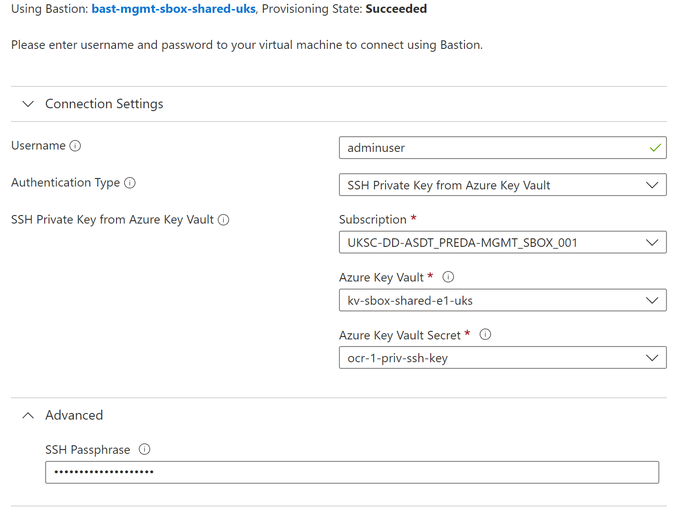

**Pre-Reqs**

- The subscription is SO1
- The Management (Hub) resources (AZ Firewall) are deployed
- The build secrets in the key vault are configured. Template entries can be created using [deploy-az-ocr.sh -z 1](../ocr-offline/create-ocr-kv-secrets-placeholder.sh -z 1)
- If a quay VM already exists in Azure from a previous build, this should be deleted.

**Deployment**
 - set the environment variables in the [env_variables_ocr1.sh](../env/env_variables_ocr1.sh) file
 - Change the parameters to match the environment. The only things that should need changing are the OCP version and size of the disk (it might need to be larger as more content is required)
```bash
export TF_VAR_data_disk_size=100
# Version of the OCP instance to install
export TF_VAR_ocp_vers="4.10.20"
```
- make sure you az login to the AAD tenant that the subscription you are deploying to is associated
- Run the following command locally from VS Code to create the VM using Terraform (Any diagnosticSettings errors can be ignored):
[deploy-az-ocr.sh -z 1](../ocr-offline/deploy-az-ocr.sh)
```bash
./ash_infra/ocr-offline/deploy-az-ocr.sh -z 1
```

- Connect to the quay VM using the following Bastion configuration to continue monitoring:



- The VM will deploy a custom script extension which once completed, spawns another process (using tmux) which mirrors theOpenShift version and Operators specified to the Quay repo that has been deployed on the VM.  This process typically takes 1 hour to complete. 

Progress of the custom script exension can be monitored within the VM using the following command:
  ```bash
  sudo tail -f /var/lib/waagent/custom-script/download/0/stderr
  ```
This has completed once 'tmux new-session' is shown.

Once that completes, progress of the Quay mirror can be monitored using the following command:
  ```bash
  sudo tail -f /root/quay_mirror.log
  ```
  When the mirror has finished, the log entry
   ```====PROCESS COMPLETE. END =====``` 
   will be logged

**Modifying the mirror content**

- edit [build-quay.sh](../scripts/build-quay.sh)
- find the section ### MIRROR CONFIG ###
- This section is to define the imageset-config yaml. Modify as appropriate. Ideally, specify the sartingVersion of the operator so to keep the size of the Quay repo as small as possible. e.g.:
```yaml
operators:
   - catalog: registry.redhat.io/redhat/redhat-operator-index:v${OPENSHIFT_MINOR}
     headsOnly: false
     packages:
       - name: rhacs-operator
         startingVersion: 3.71.0
       - name: openshift-pipelines-operator-rh 
         startingVersion: 1.7.2
   - catalog: registry.redhat.io/redhat/certified-operator-index:v${OPENSHIFT_MINOR}
     headsOnly: false
     packages:
       - name: cloud-native-postgresql
         channels:
         - name: stable
   - catalog: quay.io/gpte-devops-automation/gitea-catalog:latest
     headsOnly: false
     packages:
       - name: gitea-operator
         startingVersion: 1.3.0
   - catalog: registry.redhat.io/redhat/community-operator-index:v${OPENSHIFT_MINOR}
     headsOnly: false
     packages:
       - name: group-sync-operator
         startingVersion: 0.0.20
```
