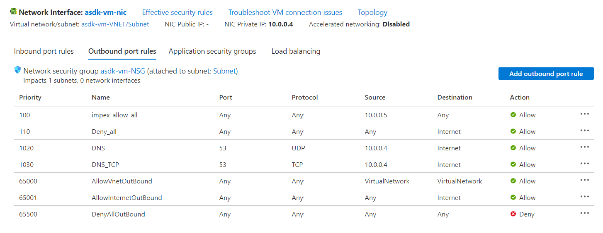

https://github.com/yagmurs/AzureStack-VM-PoC

- In Azure Portal, Open Cloud Shell, use PowerShell

- Run:
```
Set-AzContext -SubscriptionName "UKSC-DD-ASDT_PREDA-INFRA_SBOX_001"
```
- Run:
```
Find-Script Deploy-AzureStackonAzureVM | Install-Module -Force
```
- Run:  
```
Deploy-AzureStackonAzureVM -ResourceGroupName rg-asdk-01-sbox-uks -Region 'uk south' -VirtualMachineSize 'Standard_E48ds_v5' -DataDiskCount 11
```

- Delete Public IP address and deploy a Bastion to connect securely

- Get a UK NPN Server IP address
```
ping 0.uk.pool.ntp.org
```
- From within the VM, run in PowerShell:
```
C:\CloudDeployment\Setup\InstallAzureStackPOC.ps1 -TimeServer 'xxx' -DNSForwarder '8.8.8.8' -UseADFS
```

- Once the install process is running you can view progress by connecting the VM as azurestackadmin@azurestack.local, same password as Administrator account

- Takes ~10hrs to complete.

- Add Outbound port rules to the asdk-vm network settings to match the following:


- Connect to the VM as azurestackadmin@azurestack.local, install the following tools:
  - Azure CLI
  - az.powershell
  - azcopy
  - Visual Studio Code
  - Moba XTerm
  - AzCopy (copy azcopy.exe to C:\Windows)