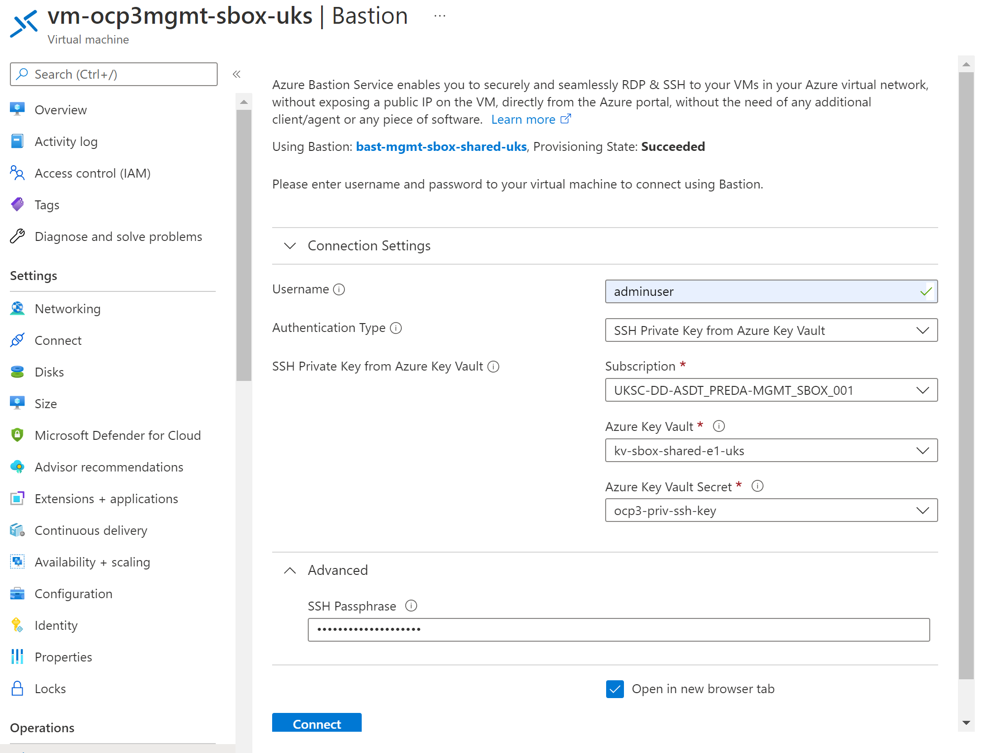

2022-11-30
This process utilising the free 90 day certificates from ZeroSSL is no longer followed and has been superseeded by the 12 month paid certificates process.

# Deploy Zero SSL Certificates

## Background
As a trusted CA, ZeroSSL is used, as it allows wildcard certificates along with SAN for specific domains. Lets Encrypt no longer allow this. We are currently using the free version and the certificates expire every three months. If going for a paid option, one year certs can be ordered: https://zerossl.com/pricing/ 

The [Application Gateway](./installation.md#azure-application-gateway-waf) and [DNS Zone delegation](./installation.md#dns-delegation) must be in place before running the scripts

## Initial Deployment

1. Ensure the Managed Identity for the Linux VM has secret access policy  get,list and set for secrets is set on the key vault.
  
2. Connect to the Linux Management VM for the OpenShift cluster via the Azure Portal using the Bastion option.

3. The process is designed to work with the initial user assigned when the cluster was deployed as it has the relevant Azure credentials cached. Switch to this user by running the following command:

`su adminuser`
`<enter the current password for the user when prompted>`


4. Now navigate to the ocp directory in the $HOME folder

`cd $HOME/ocp`

5. run the following script first, to generate the *.apps SSL certificate locally, upload it to the MGMT Key Vault and  Application Gateway, finally it will patch the OCP instance to use the renewed certificate:

`./gen-apps-cert.sh`

6. run the following script to generate the API SSL certificate locally, upload it to the MGMT Key Vault and  Application Gateway, finally it will patch the OCP instance to use the renewed certificate:

`./gen-api-cert.sh`

7. Once the scripts have been run, the Application Gateway needs updating to use the valid certificates, not the temporary self-signed TLS certs that were generated as part of the deployment process. 
  
8. The automated way can be performed running the folowing script which will update the DNS records and also assign the SSL certificates [deploy-public-dns-records.sh](./../app-gw/deploy-public-dns-records.sh)

e.g.:
```console
$ ./deploy-public-dns-records.sh -z 3
```

The above command will set up the Application Gateway used for OCP3 to use the new certificates and create the A records ( api, *.apps )on the Public DNS Zone hosted in Azure the use the Public IP address assigned to the Application Gateway. 

## Certificate Renewal
Certificates will currently expire every three months. They can be renewed as often as required.

#### Pre-Requisites
1. A Service Principal should be created on the OpenShift cluser with the role of updating the TLS Certificate secret on OpenShift. Obtain the token from the OpenShift platform admins and create / update a secret on the Key Vault. The name will be of the format '**\<OCP cluster instance>-OC-CERT-SPN'**:
  ```console  
  OCP3-OC-CERT-SPN
  ```

#### Steps
1. Connect to the Linux Management VM for the OpenShift cluster via the Azure Portal using the Bastion option. The process is designed to work with the initial user assigned when the cluster was deployed as it has the relevant Azure credentials cached. Example for OCP3 shown below.
   - Username = "adminuser"
   - Authentication Type = "SSH Private Key from Azure Key Vault"

 

2. In a new browser tab log into the Openshift Cluster, connect to the OpenShift cluster portal as the kubeadmin user, the password can be found on the Linux VM in `ocp/ocp[n]/auth/kubeadmin-password`. Generate and copy the login token. On the Linux machine, run the command provided.

3. Now navigate to the ocp directory in the $HOME folder

`cd $HOME/ocp`

4. run the following script first, to generate the *.apps SSL certificate locally, upload it to the MGMT Key Vault and  Application Gateway, finally it will patch the OCP instance to use the renewed certificate:

`./gen-apps-cert.sh`

5. run the following script to generate the API SSL certificate locally, upload it to the MGMT Key Vault and  Application Gateway, finally it will patch the OCP instance to use the renewed certificate:

`./gen-api-cert.sh`

#### Script Activity Description

- Download acme.sh from GitHub. This is used for the auto-provisioning of certificates from ZeroSSL
- Uses the VM Managed Identity to connect to Azure Subscription
- Checks to see if the *-OC-CERT-SPN exists on the Key Vault
- If it doesn't, assume it is the first time generating the cert, so use the kubeconfig file created during openshift-install
- runs oc login (using witht he SPN token or Kubeconfig)
- Obtain the SPN details for the Azure subscription hosting the Public DNS Zone in Azure from the Key Vault. If they don't exist, quit the script indicating the missing entry
  
The script setting the following environment varaiables as used by acme.sh to connect to the Azure DNS Zone:

AZUREDNS_SUBSCRIPTIONID
AZUREDNS_TENANTID
AZUREDNS_APPID
AZUREDNS_CLIENTSECRET

- Generate the certificates for the cluster using ZeroSSL (it allows wildcards) and download the signed certifcate to the local system
- convert the pem file to pfx (required by Application Gateway)
- Update the Secret on the Key Vault with the new certificate
- If this is the first time, create the config map for the CA of the new certificate, create a secret on the cluster for the certificate and patch the certificates used for the API and the ingress controller
- For subsequent runs, the secret storing the certificate is updated 

#### Manually re-link App Gateway Certificates to Keyvault Secrets

This might be required if the Certificate update process doesn't appear to be updating the Application Gateway because the Certificates are mapped to a version of the Secret rather than the root Secret. This prevents it picking up the latest version.

    #Set these variables to match the target environment
    export OCP_CLUSTER_INSTANCE="ocp4"
    export APP_GW_NAME="preda-sbox-openshift-appGW"
    export APP_GW_RG="preda-infra-vnet"
    export KEY_VAULT="kv-sbox-infra-bf04-uks"
    export MGMT_SUB=""
    export INFRA_SUB="UKSC-DD-ASDT_PREDA-INFRA_SBOX_002"

    az login

    #Check whether the Certificates are mapped to the root Secret or an old version of the Secret
    az network application-gateway ssl-cert list --resource-group $APP_GW_RG --gateway-name $APP_GW_NAME

    #Map App Certificate to Secret
    secret_name="${OCP_CLUSTER_INSTANCE}-tls-app"
    kvid=$(az keyvault secret list --vault-name $KEY_VAULT --query "[?name=='${secret_name}'].id" -o tsv)
    az network application-gateway ssl-cert create --resource-group $APP_GW_RG --gateway-name $APP_GW_NAME -n "${secret_name}" --key-vault-secret-id ${kvid}

    #Map API Certificate to Secret
    secret_name="${OCP_CLUSTER_INSTANCE}-tls-api"
    kvid=$(az keyvault secret list --vault-name $KEY_VAULT --query "[?name=='${secret_name}'].id" -o tsv)
    az network application-gateway ssl-cert create --resource-group $APP_GW_RG --gateway-name $APP_GW_NAME -n "${secret_name}" --key-vault-secret-id ${kvid}

    #Validate mappings
    az network application-gateway ssl-cert list --resource-group $APP_GW_RG --gateway-name $APP_GW_NAME