# Installation

## Pre-requisites

1. At least one Azure subscription (2 preferable).
   
   1. Subscription for central management resources (hereby referenced as MGMT ).
    
   2. Subscription for the OpenShift Cluster Platform (OCP) resources (hereby referenced as INFRA).
   
       *If one subscription is available, the MGMT and INFRA resources can be deployed to the same subscription.* 

2. An Azure AD account in the same tenant as the Azure Subscription(s).
   
   The user must have the following roles at the subscription level:
    - Contributor
    - User Access Administrator

2. An Azure AD Service Principal in the same tenant as the Azure Subscription(s).
   
   The Service Principal must have the following roles at the MGMT anbd INFRA subscription level:
    - Contributor
    - User Access Administrator

   The Service principal is used to provision the OpenShift cluester via the IPI method, as well as the SSL certificate generation process.

3. For deployment activites, a Linux host (or Windows subsystem for Linux)
   
   - [Install Azure CLI](https://docs.microsoft.com/en-us/cli/azure/install-azure-cli)
  
   - [Install Terraform](https://learn.hashicorp.com/tutorials/terraform/install-cli#install-terraform)

4. (*optional but recommended*) Visual Studio Code for editing files. 

## One time installation activities

From the Linux Shell, navigate to the [./azureinfra/SO1](./..) directory.

1. Edit the Environment helper script located in [./env/](./../env/) to reflect the settings for the environment and save it as env_variables_<cluster_name>.sh (e.g. [./env/env_variables_ocp1.sh](./../env/env_variables_ocp1.sh))

2. Login via Azure CLI to the correct subscription:

`$ az login`

`$ az account set --subscription <Name of the MGMT subscription>`


3. Create Azure Resources for Terraform State

    - Navigate to the /azureinfra folder

    - Run:
   
   `$ ./mgmt/deploy-tf-state.sh`


    This will deploy the resource group and Storage Account required to store the TF State files


4. Create the central management resources.
   - Get the details for the cluster/environment from the information table  [./azureinfra/cluster-info.md](./../../../cluster-info.md). Make a note of the *env_instance* value.
   - Run:
  
    `$ ./mgmt/deploy-az-mgmt-resources.sh -z <env_instance>`

    e.g.

    `$ ./mgmt/deploy-az-mgmt-resources.sh -z 1`

    This will deploy a resource group ( **rg-mgmt-\<*operatingEnv*\>-shared-\<*locationId*\>**  e.g. **rg-mgmt-prod-shared-uks**), virtual network, Azure Firewall & Policy, Key Vault and Azure Bastion Service.

5. Create Key Vault secrets required by other workflows.

   - To set up the secrets in the key vault, with no values, run the following:

    `$ ./ocpCluster/setup-az-ocp-mgmt-kv.sh -z <env_instance>`

   - The Service Principal that has been created / supplied typically looks like this:
```
{
 "subscriptionId":"***subscription_id***",
 "clientId":"***client_id***",
 "clientSecret":"***client_secret***",
 "tenantId":"***tenant_id***"
}
```
   The clientId and clientSecret are required. Key Vault secrets will be manualy created using this information

   -  Via the Azure Portal, connect to the MGMT subscription and locate the newly created resource group (e.g. rg-mgmt-prod-shared-uks )
   
   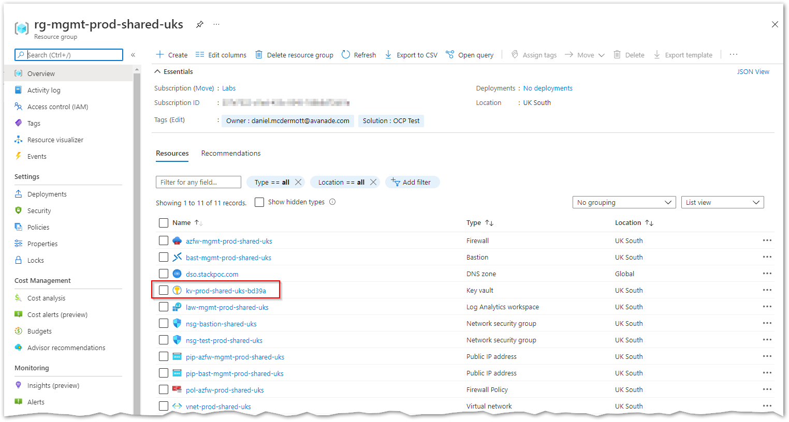 

   - Select the Key Vault resource, Secrets and then Generate/Import 
  
   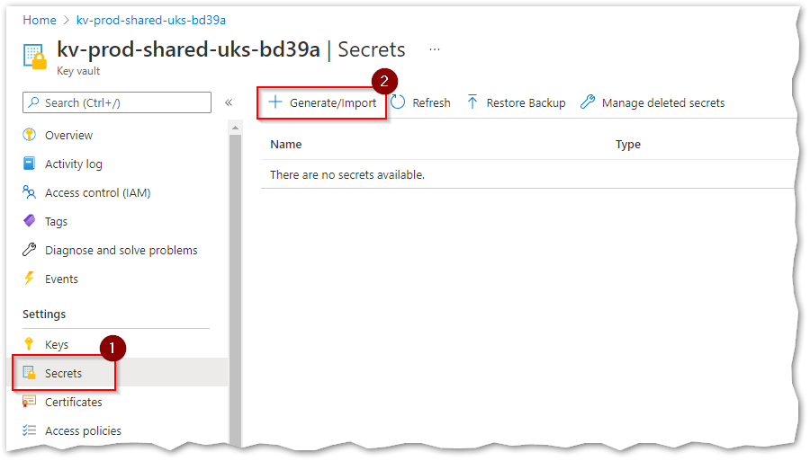 

   - Set the Name as **DNS-SPN-APP-ID**, copy/paste ```clientId``` data into the secret field, set the Activation Date, and then click on Create.
  
   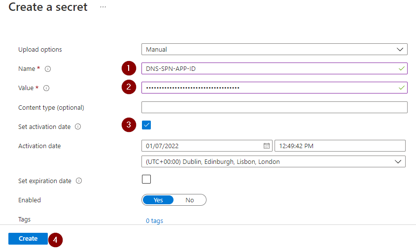 

   - Create another secret, set the Name as **DNS-SPN-CLIENT-SECRET**, copy/paste ```clientSecret``` data into the secret field, set the Activation Date, and then click on Create.

    

   - Create another secret, this time for the OpenShift PullSecret required when deploying the cluster.
     Set the Name as **OCP-PULL-SECRET** and paste the PullSecret Json obtained from the Red Hat portal.

      [OpenShift Pull Secret](https://console.redhat.com/openshift/install/pull-secret)
  
   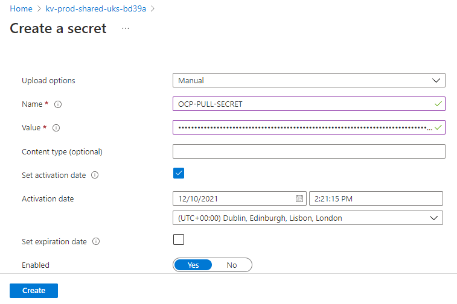 

 - Create another secret, this time for the Public SSH key required for deployment of the cluster and accessing the nodes in case of break-glass situations.
     Set the Name as **\<ClusterInstance\>-PUB-SSH-KEY**  (e.g. OCP1-PUB-SSH-KEY) and paste the Public SSH key.
  
   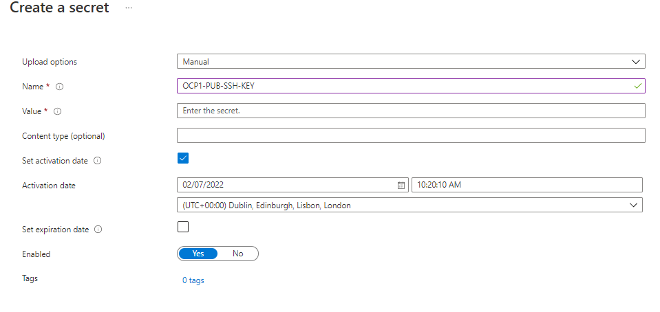
   
## Deploy Infrastructure Management Resources

To deploy the OpenShift Cluster supporting infrastructure and resource groups, assuming that all the pre-requisite activities have been completed, run the following script from a Linux Shell:

`$ ./ocpCluster/deploy-az-ocp-mgmt.sh -z <env_instance>`

This will deploy a resource group ( **rg-*\<OCP-Instance\>*mgmt-*\<operatingEnv\>*-*\<locationId\>***  e.g. **rg-ocp2mgmt-prod-uks**), virtual network, route table, Network Security Group and Storage accounts.

An additional, empty resource group is created ( **rg-*\<OCP-Instance\>*-*\<operatingEnv\>*-*\<locationId\>***  e.g. **rg-ocp2-prod-uks**), which will contain the OpenShift cluster resources when the IPI installer is run.

The process can take up to 40 minutes to complete. This is due to the provisioning of the Linux VM - it can take up to 30 minutes for the managed service identity to be assigned, so that it can be used to access Azure resources without passing credentials.

## Ensuring the correct RBAC roles are applied

In restricted environments where the user account running the Terraform does not have Owner role for the subscription, then a request should be made to the subscription owner that the following roles are assigned to the appropriate Resource Groups before attempting to run the Cluster installation:

Roles:

 - Contributor
 - User Access Administrator

Resource Groups:

| Resource Group|Subscription|Role|
|:--------------|:-----------|:---|
| **rg-*\<OCP-Instance\>*mgmt-*\<operatingEnv\>*-*\<locationId\>*** | Infra | Contributor|
| **rg-*\<OCP-Instance\>*mgmt-*\<operatingEnv\>*-*\<locationId\>*** | Infra | User Access Administrator|
| **rg-*\<OCP-Instance\>*-*\<operatingEnv\>*-*\<locationId\>*** | Infra | Contributor|
| **rg-*\<OCP-Instance\>*-*\<operatingEnv\>*-*\<locationId\>*** | Infra | User Access Administrator|
| **rg-mgmt-*\<operatingEnv\>*-shared-*\<locationId\>*** | Mgmt  | Contributor|
| **rg-mgmt-*\<operatingEnv\>*-shared-*\<locationId\>*** | Mgmt  | User Access Administrator|


### Reset Linux VM Password

Once the workflow has completed, the password for the Linux management host needs to be reset. (CIS L2 controls does not allow login using SSH key via bastion service)

- Navigate to VM resource in the Azure Portal. It will be located in the INFRA subscription, in the infra management resource group
  
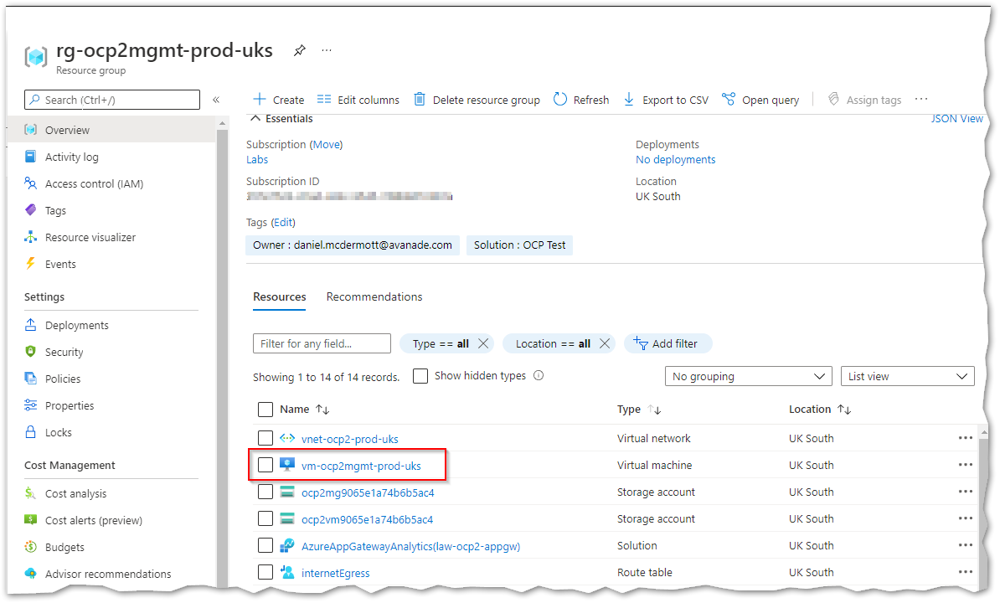

- From the left blade, select **Reset Password**
 
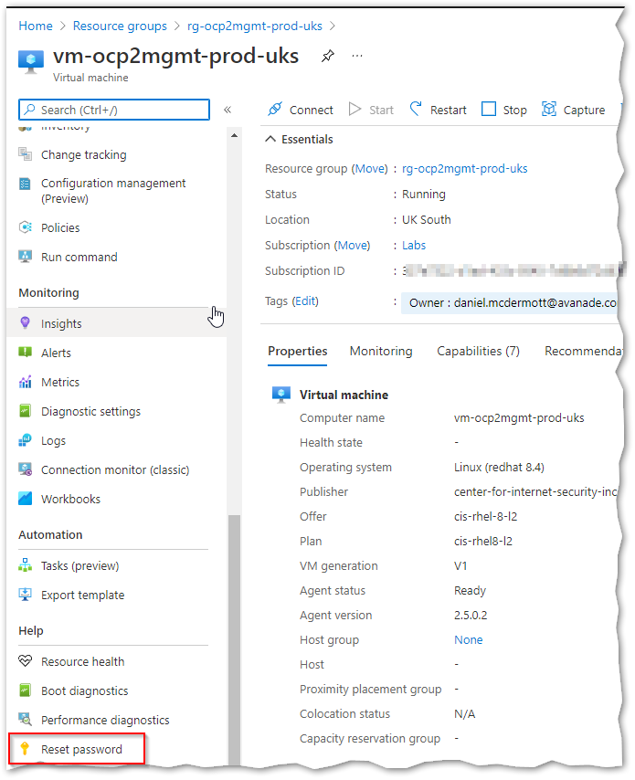

-  Selct the **Reset passwrod** radio button, enter the Username and enter a secure password. To apply, click on **Update**

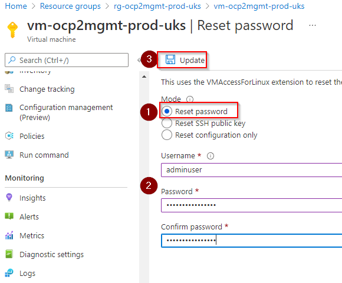

### Connect to the Linux VM

- To open an SSH session on the Linux VM via the Azure Bastion service, via the Azure portal, navigate to the VM (per the [reset Linux VM password](#reset-linux-vm-password) method)

- From the Overview pane, select **Connect** and then choose **Bastion** from the drop down menu.

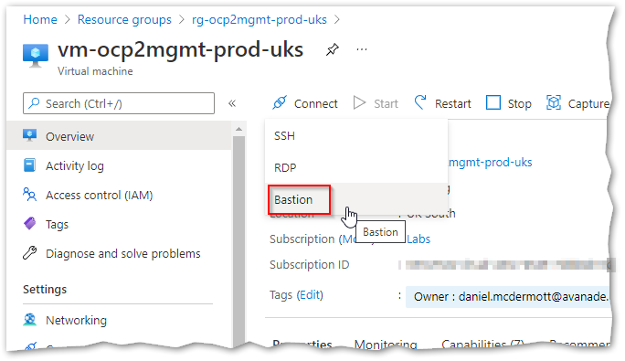

- Enter the username and password details, then click on **Connect**

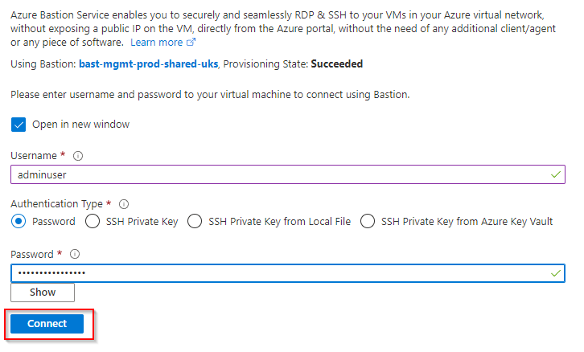

- A new browser window will open. Click on **Allow** when prompted.

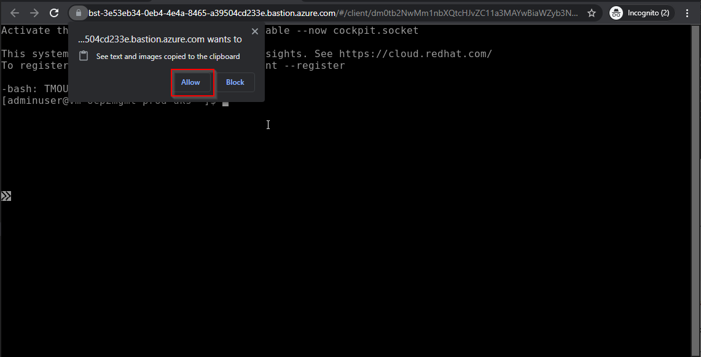


## Deploy the OpenShift Cluster

- [Logon to the Linux management host](#connect-to-the-linux-vm).

- Navigate to the ocp directory in the $HOME folder

`cd $HOME/ocp`

Run:

`$ ./install-cluster.sh`

The script runs the following command:

`$ nohup ./openshift-install create cluster --dir=./<ocp instance> `

As the session timeout is very short for the CIS L2 image, `nohup` is used so the install process does not 'hang up' when the session ends.  The output from the OpenShift Install is located in the nohup.out file.

If the command seems to return to the prompt after a short period of time. inspect the `nohup.out` file for errors.  


## Azure Application Gateway (WAF) 

To deploy the WAF, allowing public access to the OpenShift Cluster deployed within the Azure subscription, run the following script from a Linux Shell:

`$ ./app-gw/deploy-az-app-gw.sh -z <env_instance>`

The current configuration for the WAF is to deny all but allowed IP addresses. This is designed as such for allowing teams to perform their commissioning activities.

The Access List is configured by modiying the [variables.tf](./../app-gw/variables.tf) file, locating the variable `app_gw_allow_ips` and adding the IP addresses as required. For example:

```
variable "app_gw_allow_ips" {
  default = [
  "1.2.3.4",
  "5.6.7.8",
  "10.10.10.10/28"
 ]
}
```


### Deploy Zero SSL Certificates

As a trusted CA, ZeroSSL is used, as it allows wildcard certificates along with SAN for specific domains. Lets Encrypt no longer allow this. 

The [Application Gateway](#azure-application-gateway-waf) and [DNS Zone delegation](#dns-delegation) must be in place before running the scripts

- From a shell session on the Linux management VM, navigate to the ocp directory in the $HOME folder

`cd $HOME/ocp`

- run the following script first, to generate the *.apps SSL certificate locally, upload it to the MGMT Key Vault and upload it the Application Gateway, finally it will patch the OCP instance to use this new certificate:

`./gen-apps-cert.sh`

- run the following script to generate the API SSL certificate locally, upload it to the MGMT Key Vault and upload it the Application Gateway, finally it will patch the OCP instance to use this new certificate:

`./gen-api-cert.sh`

- Once the scripts have been run, the Application Gateway needs updating to use the valid certificates, not the temporary self-signed TLS certs that were generated as part of the App Gateway deployment process. From the Azure portal, navigate to the Azure Application Gateway instance deployed for the OCP cluster:

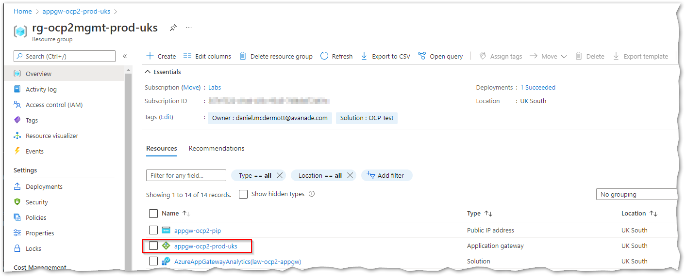

- From the left pane, select **Listeners** and then ***\<ocp-instance\>*-apps-https-lstn**

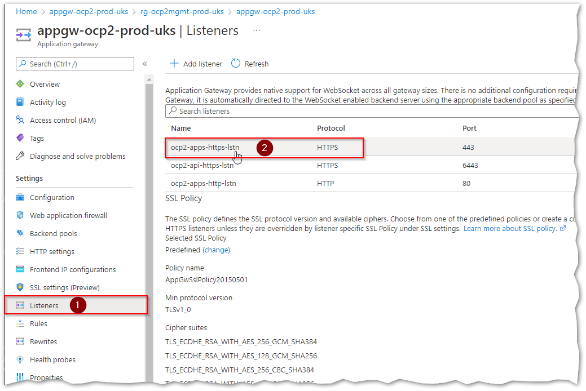

- Select the **Certificate** drop down, and then ***\<ocp-instance\>*-tls-app**. Select **Save** to apply the change.

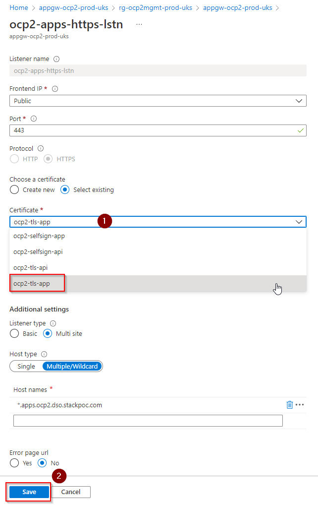

- From the left pane, select **Listeners** and then ***\<ocp-instance\>*-api-https-lstn**

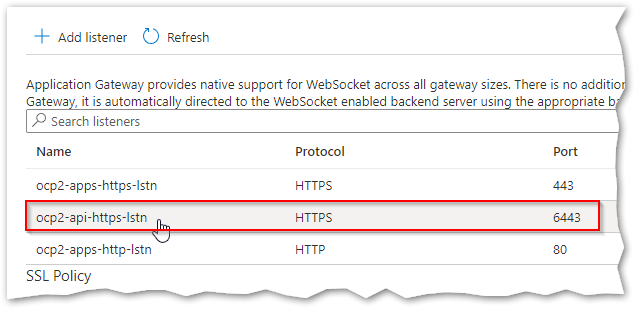

- Select the **Certificate** drop down, and then ***\<ocp-instance\>*-tls-api**. Select **Save** to apply the change.

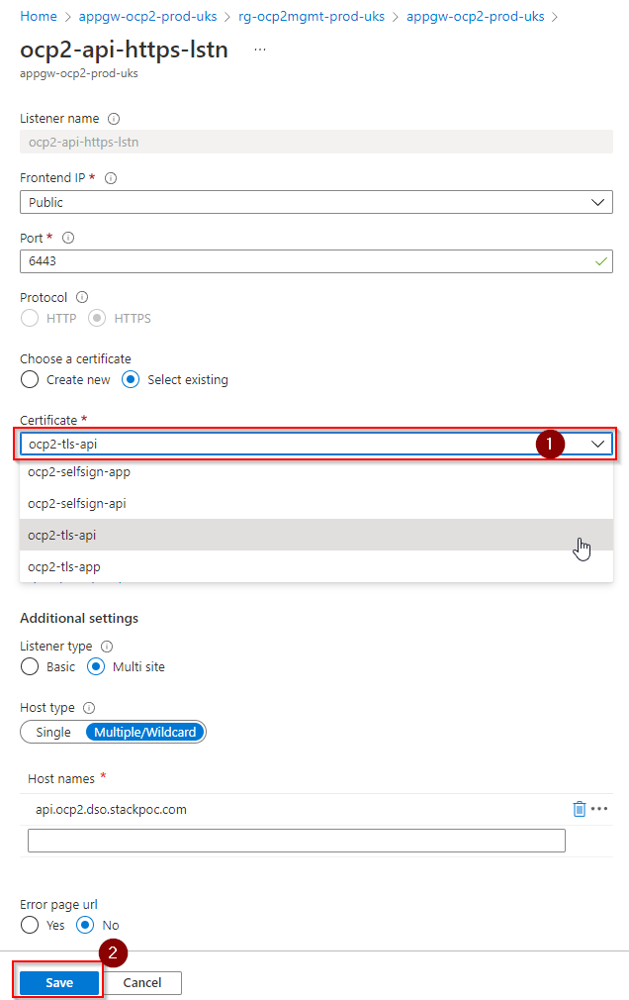

# Publish Cluster via WAF

**Create A records on DNS zone**
--------------------------------

To publish the OpenShift Cluster externally via the WAF, run the following script from a Linux Shell:

`$ ./app-gw/deploy-public-dns-records.sh -z <env_instance>`

This will create 2 A records

- **api.\<ocp-instance\>**

- **\*.apps.\<ocp-instance\>**

It will use the Public IP address of the Application Gateway for each A Record


### DNS Delegation

 **Create NS records on parent DNS zone**  ***(Completed by owner of parent DNS zone)***


- Navigate to the Management subscription and the resource group that hosts these resources.  Locate the DNS zone for the environment and open the resource. locate the Name Servers for the Zone:

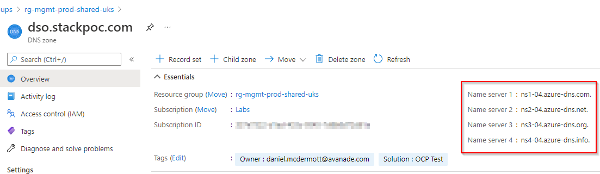

- Create a **NS** record on the parent DNS zone, using the name server records obtained for the sub-domain.
