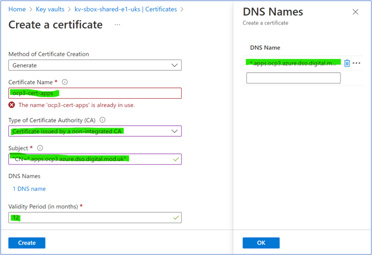
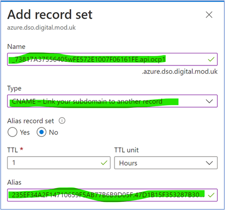
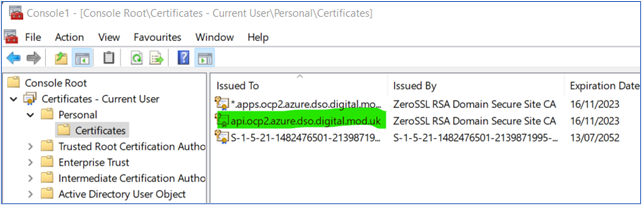
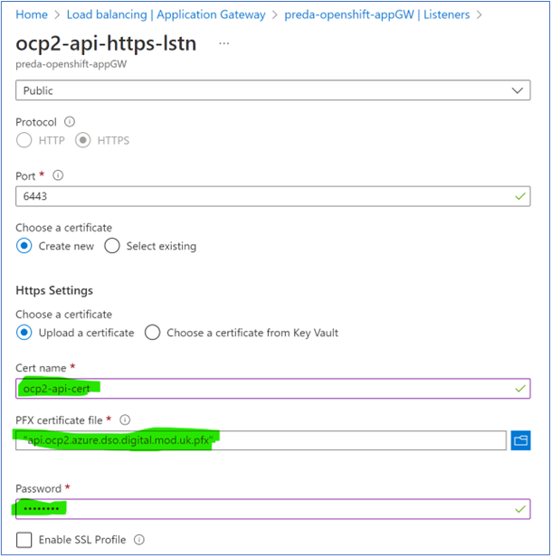

# Step 1 - Create a Certificate for a New Domain

## 1.1 Azure Key Vault
1. In the cluster-specific Azure Key Vault create a new Certificate, specifying the following information and following the existing naming convention:



2. Open the Certificate, click Certificate Operation -> Download CSR.

3. Email CSR to Callum Skinner to enter into ZeroSSL website. 

4. Callum will send back CNAME details. 

## 1.2 azure.dso.digital.mod.uk Domains
This DNS Zone is managed by D2S and can be found in the Azure DNS Zone [here](https://portal.azure.com/#@iace.mod.gov.uk/resource/subscriptions/233d13b4-dd1d-4d9a-926d-73332a697e07/resourceGroups/rg-mgmt-prod-shared-uks/providers/Microsoft.Network/dnszones/azure.dso.digital.mod.uk/overview) on Official Dev. This manages domains for all four clusters.

1. Create this record in the [Azure DNS Zone](https://portal.azure.com/#@iace.mod.gov.uk/resource/subscriptions/233d13b4-dd1d-4d9a-926d-73332a697e07/resourceGroups/rg-mgmt-prod-shared-uks/providers/Microsoft.Network/dnszones/azure.dso.digital.mod.uk/overview), this is used to validate ownership of the domain.



2. Let Callum know the CNAME record is created and he can continue with the certificate generation.

3. Callum will send over a .zip which contains the certificate (certificate.crt) and the root certificate (ca_bundle.crt - this isn't the full chain). In the Key Vault, select the Certificate, click Certificate Operation -> Merge Signed Request, and upload the certificate.crt file. In the Key Vault, the Certificate will then move from In Progress to Completed

## 1.3 Alternate Domains
For other domains such as digital.mod.uk, the CSR is generated and sent to Callum as above. The CNAME record need to be created in the ModCloud-managed Octo DNS which requires access to the [foundry-dns](https://github.com/defencedigital/foundry-dns) Git Repo.

1. Create a Feature Branch and add the CNAME record to the relevant yaml files using an existing record as a template. 

2. Perform a pull request to main which will trigger the automated build and test. Note that the Octo DNS automated checks require the DNS entries in a non-specific alphabetical order and you may need to trial and error for it to pass.

3. Once the build passes, contact Matt Parker for release approval.

4. Once the merge has been approved, click Complete Merge. The DNS changes will then be applied almost immediately. Notify Callum to continue with certificate creation.

5. Callum will send over a .zip which contains the certificate (certificate.crt) and the root certificate (ca_bundle.crt - this isn't the full chain). In the Key Vault, select the Certificate, click Certificate Operation -> Merge Signed Request, and upload the certificate.crt file. In the Key Vault, the Certificate will then move from In Progress to Completed

# Step 2 - Apply to Azure Application Gateway

## 2.1 Scripted Process
A script has been created to create all the required components within the App Gateway and assign it the certificate from Key Vault. This can be run using the following syntax:

```
./azureinfra/SO1/app-gw/add-listener-alt-domain/add-listener-alt-domain.sh -a "dev-foundry-mod-uk" -b "dev.foundry.mod.uk" -z 1
```

Alternatively there are scripts for creating all the Listeners for a cluster in the same folder.

## 2.2 Manual Process
Importing a certificate PFX file into the App Gateway requires the file to have a password. To do this, we can import the file locally into the MMC Console and export with a default password applied.

This process may need to be followed if there are issues with the automated process above.

1.	Key Vault – Certificates -> click Certificate -> click Current Version -> Download in PFX

2.	Double-click file to load into MMC

3.	Open MMC, add Certificate, snap-in, right-click Certificate, All Tasks, Export



4.	Select include private key, add a default password “password”, save file

### 2.2.1 Existing Domains

5.	Application Gateway -> Listeners -> click Listener

6.	Choose a certificate -> Create new -> Upload a certificate

7.	Enter Cert name, select PFX file, enter password



### 2.2.2 New Domains
Create the following new App Gateway components by copying configuration settings from an existing domain:
a)	Backend Pool
b)	Backend Setting
c)	Listener
d)	Routing Rule
e)	Rewrite Set
f)	Health Probe

##2.3 Debugging Azure App Gateway Certificates
If the automated deployment or redeployment isn't working correctly it might be necessary to identify and delete the current Certificate on the App Gateway. This can't be done through the Portal and requires Azure CLI.
```
#Subscription containing App GW
az account set --subscription UKSC-DD-ASDT_PREDA-INFRA_SBOX_001

#View App Gateway Certificates
az network application-gateway ssl-cert list -g rg-ocp3mgmt-sbox-uks --gateway-name appgw-ocp3-sbox-uks

#Delete a Certificate
az network application-gateway ssl-cert delete -g rg-ocp3mgmt-sbox-uks --gateway-name appgw-ocp3-sbox-uks -n ocp3-cert-api
```

# Step 3 – Update Openshift Secret & Routing
Team Openshift to complete
