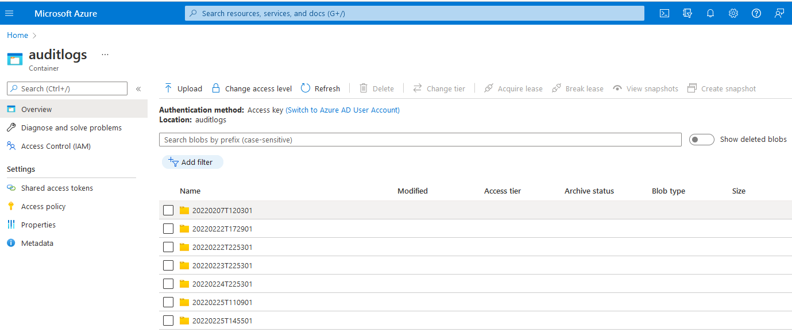
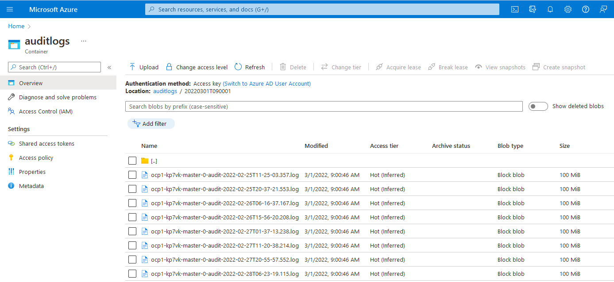

# Openshift auditlog backup
The auditlog backup configuration consists of a configmap, a cronjob, a service account and a role / rolebinding. These files are required to enable the audit log backup process.

Details of the configuration is shown in the table below.

|Description                      |Details|
|:----------                      |:------|
|Namespace                        | openshift-config|
|Service account:                 | auditlog-backup |
|Role:                            | auditlog-clusterole |
|RoleBinding:                     | auditlog-clusterbinding |
|Cron job:                        | cronjob-auditlog-backup |
|Config map :                     | auditlog-backup-script |
|Schedule:                        | 09:00am daily |
|Location back-up data:           | Azure BLOB store https://ocp1mg847a4b002a9bd2e2.blob.core.windows.net/auditlogs|

## auditlog-clusterole.yaml
Sufficient permissions are required for the service account in order to run the backup job. To enable this, a new role was created with get, list and watch permissions to nodes and pods.

To configure this for the first time
Run the following command
    
    oc apply -f auditlog-clusterole.yaml

## auditlog-clusterbinding.yaml
Having created a role with the correct permissions, this needed to be linked to the service account. This is done using the auditlog-clusterbinding.yaml file

To configure this for the first time
Run the following command
    
    oc apply -f auditlog-clusterbinding.yaml

## auditlog-cronjob.yaml

Now that the auditlog-clusterole and auditlog-clusterbinding are in place, the job can now be scheduled.

Scheduled for 09:00 daily and does the following, 
- Runs under the auditlog-backup serviceaccount against the node-role.kubernetes.io/master

- Creates a pod using the quay.io/openshift-release-dev/ocp-v4.0-art-dev image

- Mounts master node directories necessary to be able to expose and run the backup-audit-log.sh script from within the container 

- Uses a config map called auditlog-backup-script containing the script to execute the backup job

## Deploy auditlog cronjob.yaml
To deploy / redeploy the auditlog-cronjob, carry out the following steps

Pull this auditlog-backup repo locally

Run the following command
    
    oc apply -f auditlog-cronjob.yaml
 
## audit-configmap.yaml
This creates a backup-audit-log.sh script which does the following... 
 
- Downloads the azcopy utility
- Runs the oc get nodes command to list the master nodes
- Runs the oc adm node logs command against one of the master nodes to get the audit logs
- Repeat the process on the other master nodes
- Use azcopy to transfer the audit logs to the Azure Blob store

 
## Deploy auditlog configmap.yaml
To deploy / redeploy the auditlog-configmap, carry out the following steps

Pull this auditlog-backup repo locally

Run the following command
    
    oc apply -f auditlog-configmap.yaml

 
# Verify backup is successful via Openshift

    oc get pod -openshift-config
    
 You should see several jobs that have completed successfully
 
    cronjob-auditlog-backup-27398119-dz66r   0/1     Completed   0          164m
    cronjob-auditlog-backup-27398133-gvkc8   0/1     Completed   0          150m
    cronjob-auditlog-backup-27398143-nxhmp   0/1     Completed   0          140m
    
    
 View the logs of the latest pod
 
    oc logs cronjob-auditlog-backup-27398143-nxhmp -n openshift-config
    
Check the log for the following output

    Retrieving Master nodes
    Collecting audit log audit-2022-02-25T11-25-03.357.log from ocp1-kp7vk-master-0
    Collecting audit log audit-2022-02-25T20-37-21.553.log from ocp1-kp7vk-master-0
    Collecting audit log audit-2022-02-26T06-16-37.167.log from ocp1-kp7vk-master-0
    Collecting audit log audit-2022-02-26T15-56-20.208.log from ocp1-kp7vk-master-0
    Collecting audit log audit-2022-02-27T01-37-13.238.log from ocp1-kp7vk-master-0
    Collecting audit log audit-2022-02-27T11-20-38.214.log from ocp1-kp7vk-master-0
    Collecting audit log audit-2022-02-27T20-55-57.552.log from ocp1-kp7vk-master-0
    Collecting audit log audit-2022-02-28T06-23-19.115.log from ocp1-kp7vk-master-0
    Collecting audit log audit-2022-02-28T15-44-53.180.log from ocp1-kp7vk-master-0
    Collecting audit log audit-2022-03-01T01-09-57.800.log from ocp1-kp7vk-master-0
    Collecting audit log audit.log from ocp1-kp7vk-master-0
    Collecting audit log audit-2022-02-25T13-34-27.284.log from ocp1-kp7vk-master-1
    Collecting audit log audit-2022-02-25T23-02-34.469.log from ocp1-kp7vk-master-1
    Collecting audit log audit-2022-02-26T08-45-06.755.log from ocp1-kp7vk-master-1
    Collecting audit log audit-2022-02-26T18-27-30.147.log from ocp1-kp7vk-master-1
    Collecting audit log audit-2022-02-27T04-13-31.576.log from ocp1-kp7vk-master-1
    Collecting audit log audit-2022-02-27T13-55-26.462.log from ocp1-kp7vk-master-1
    Collecting audit log audit-2022-02-27T23-26-21.577.log from ocp1-kp7vk-master-1
    Collecting audit log audit-2022-02-28T08-53-42.785.log from ocp1-kp7vk-master-1
    Collecting audit log audit-2022-02-28T18-07-00.544.log from ocp1-kp7vk-master-1
    Collecting audit log audit-2022-03-01T03-35-03.815.log from ocp1-kp7vk-master-1
    Collecting audit log audit.log from ocp1-kp7vk-master-1
    Collecting audit log audit-2022-02-25T13-18-35.549.log from ocp1-kp7vk-master-2
    Collecting audit log audit-2022-02-25T22-42-09.180.log from ocp1-kp7vk-master-2
    Collecting audit log audit-2022-02-26T08-25-44.329.log from ocp1-kp7vk-master-2
    Collecting audit log audit-2022-02-26T18-07-58.018.log from ocp1-kp7vk-master-2
    Collecting audit log audit-2022-02-27T03-51-16.955.log from ocp1-kp7vk-master-2
    Collecting audit log audit-2022-02-27T13-31-59.119.log from ocp1-kp7vk-master-2
    Collecting audit log audit-2022-02-27T23-03-20.321.log from ocp1-kp7vk-master-2
    Collecting audit log audit-2022-02-28T08-33-57.906.log from ocp1-kp7vk-master-2
    Collecting audit log audit-2022-02-28T17-47-56.680.log from ocp1-kp7vk-master-2
    Collecting audit log audit-2022-03-01T03-15-50.669.log from ocp1-kp7vk-master-2
    Collecting audit log audit.log from ocp1-kp7vk-master-2
    Getting Azure azcopy CLI tool...
    --2022-03-01 09:00:35--  https://azcopyvnext.azureedge.net/release20220228/azcopy_linux_amd64_10.14.0.tar.gz
    Resolving azcopyvnext.azureedge.net (azcopyvnext.azureedge.net)... 104.77.118.88, 104.77.118.90, 2a02:26f0:5d00:10::684d:a0d4, ...
    Connecting to azcopyvnext.azureedge.net (azcopyvnext.azureedge.net)|104.77.118.88|:443... connected.
    HTTP request sent, awaiting response... 200 OK
    Length: 12458205 (12M) [application/gzip]
    Saving to: 'azcopy.tar.gz'

         0K .......... .......... .......... .......... ..........  0% 84.2M 0s
        50K .......... .......... .......... .......... ..........  0%  109M 0s
       100K .......... .......... .......... .......... ..........  1% 31.9M 0s
   
     12050K .......... .......... .......... .......... .......... 99%  124M 0s
     12100K .......... .......... .......... .......... .......... 99%  128M 0s
     12150K .......... ......                                     100%  160M=0.09s

    2022-03-01 09:00:35 (127 MB/s) - 'azcopy.tar.gz' saved [12458205/12458205]

    Uploading audit logs to Azure
    INFO: Scanning...
    INFO: Any empty folders will not be processed, because source and/or destination doesn't have full folder support

    Job 0933625a-b9aa-ea4b-69fe-a23bb4289929 has started
    Log file is located at: /root/.azcopy/0933625a-b9aa-ea4b-69fe-a23bb4289929.log

    71.9 %, 0 Done, 0 Failed, 30 Pending, 0 Skipped, 30 Total, 2-sec Throughput (Mb/s): 3628.3958

    Job 0933625a-b9aa-ea4b-69fe-a23bb4289929 summary
    Elapsed Time (Minutes): 0.2026
    Number of File Transfers: 30
    Number of Folder Property Transfers: 0
    Total Number of Transfers: 30
    Number of Transfers Completed: 30
    Number of Transfers Failed: 0
    Number of Transfers Skipped: 0
    TotalBytesTransferred: 3145710764
    Final Job Status: Completed

    Audit Files Successfully copied to Azure store https://ocp1mg847a4b002a9bd2e2.blob.core.windows.net/auditlogs
    
    
  # Verify the logs have been generated in Azure
  
 * Login to the Azure Cloud console
 * Navigate to Home > ocp1mg847a4b002a9bd2e2 > Containers > auditlogs
 
  * Select the latest backup folder (in date format)
 
   * The auditlog snapshot will be shown
 
  
  
    
    
