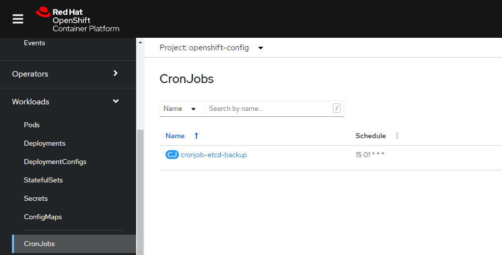
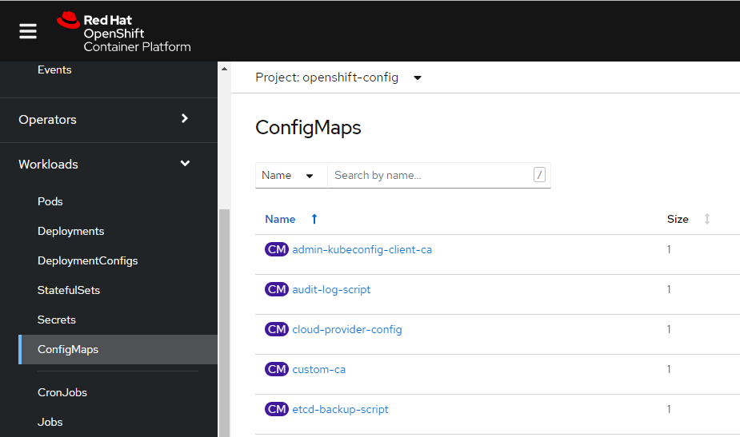
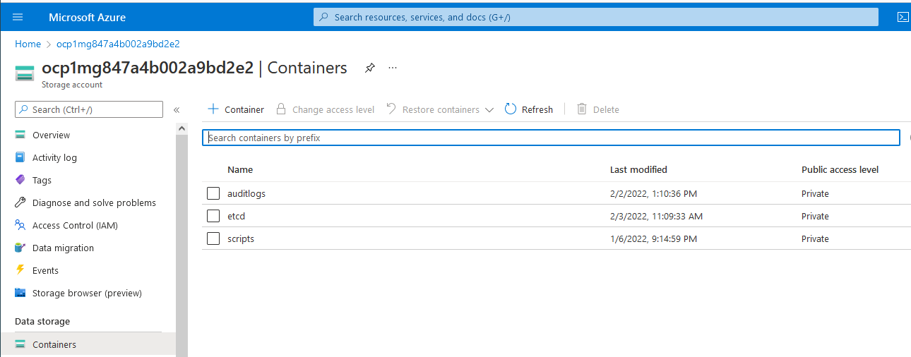
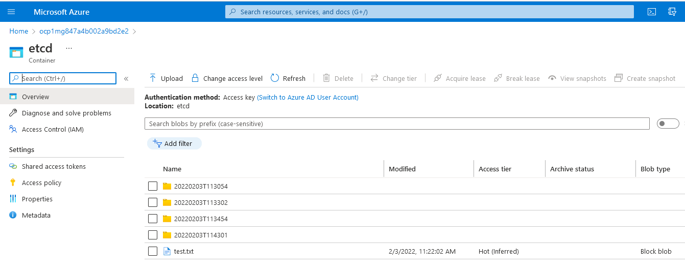
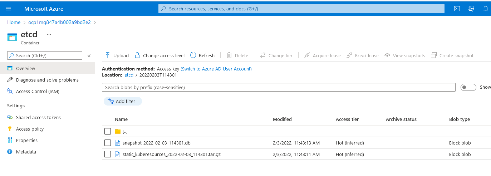

# Openshift etcd-backup
Two yaml files have been configured to enable the etcd backup process. A backup-configmap and a backup-cronjob. 
Details of the configuration is shown in the table below.

|Description                      |Details|
|:----------                      |:------|
|Namespace                        | openshift-config|
|Service account:                 | etcd-backup |
|Cron job:                        | cronjob-etcd-backup |
|Config map :                     | etcd-backup-script |
|Schedule:                        | 01:15am daily |
|Location back-up data:           | Azure BLOB store https://ocp1mg847a4b002a9bd2e2.blob.core.windows.net/etcd |

## backup-cronjob.yaml

Scheduled for 01:15 daily, runs as the etcd-backup service account against the node-role.kubernetes.io/master

- Creates a pod quay.io/openshift-release-dev/ocp-v4.0-art-dev which is referenced as a static pod manifest named etcd-ensure-env-vars from /etc/kubernetes/manifests/etcd-pod.yaml

- Mounts master node directories necessary to be able to expose and run the etcd-backup.sh script from within the container 

- Uses a config map named etcd-backup-script containing the script to execute the backup job

## Deploy backup cronjob
To deploy / redeploy the backup-cronjob, carry out the following steps

Pull this etcd-backup repo locally

Run the following command
    
    oc apply -f backup-cronjob.yaml
 
## backup-configmap.yaml
 
This creates a etcd-backup.sh script which does the following... 
 
- Copies the /usr/local/bin/cluster-backup.sh script on the master to /tmp/cluster-backup.sh on the container

- Makes a mod to /tmp/cluster-backup.sh where it removes the reference to dl_etcdctl which is not needed when ran in this context

- Runs /tmp/cluster-backup.sh and outputs the backup data to /assets/backup on the container

- Downloads the latest version of the azcopy tool from MicrosoftRuns azcopy to upload the files in /assets/backup to the Azure BLOB store using a SAS key. Files are saved into a sub-directory in Azure containing the date and timestamp of the cron job
 
 
 
## Deploy backup configmap
To deploy / redeploy the backup-configmap, carry out the following steps

Pull this etcd-backup repo locally

Run the following command
    
    oc apply -f backup-configmap.yaml

 
# Verify backup is successful via Openshift

    oc get pod -openshift-config
    
 You should see several jobs that have completed successfully
 
    cronjob-etcd-backup-27398119-dz66r   0/1     Completed   0          164m
    cronjob-etcd-backup-27398133-gvkc8   0/1     Completed   0          150m
    cronjob-etcd-backup-27398143-nxhmp   0/1     Completed   0          140m
    
    
 View the logs of the latest pod
 
    oc logs cronjob-etcd-backup-27398143-nxhmp -n openshift-config
    
Check the log for the following output

    Job 4dc98208-a3aa-5e48-6468-0376db6ed30f summary
    Elapsed Time (Minutes): 0.0668
    Number of File Transfers: 2
    Number of Folder Property Transfers: 0
    Total Number of Transfers: 2
    Number of Transfers Completed: 2
    Number of Transfers Failed: 0
    Number of Transfers Skipped: 0
    TotalBytesTransferred: 469902499
    Final Job Status: Completed

    Files uploaded to Azure BLOB store
    
  # Verify the logs have been generated in Azure
  
  * Login to the Azure Cloud console
  * Navigate to Home > ocp1mg847a4b002a9bd2e2 > Containers > etcd
 
 
 
  * Select the latest backup folder (in date format)
 
 
  * The etcd snapshot will be shown
 
  
  
    
    
