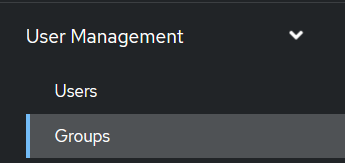
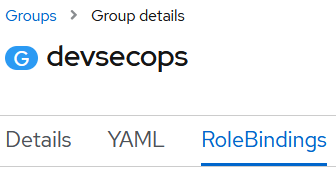

## Note: 
We are moving to GitOps approach to apply any changes to the custom roles to make sure no drift happens between clusters.
To update the `developer-role` make sure to update the files in `dayzero/legion/cohorts/openshift/16-cluster-roles` and make sure that the ArgoCD App Sync is successful in each cluster.

# Openshift custom roles
Two new custom roles have been created within Openshift for the DevSecOps team and the developers onboarded onto the system

Details of the roles are shown in the table below.

|Role name                        |Description|
|:----------                      |:------|
|dso-admin:                 | This role (based on the default self provisioner and edit roles) allows the DevSecOps team admin access to all namespaces|
|                                 | Members of this team can also modify Resource quotas and limit ranges for any namespace.| 
|                                 | Cluster admin priviledges are not permitted within this role.| 
|developer-role:                  | This role (based on the default edit role) allows the developers onboarded onto the system access to pods/services etc in their own namespace.| 
|                                 | Members of this role cannot remove, change or modify default Resource Quotas or Network Policies however, |
|                                 | they can create a Network policy to another namespace they have access to |
|cert-renewal-cr:                 | This role was created for th cert-renewal serviceaccount... in order for an automated certificate      renewal process to be deployed from Azure. The role gives access to modifiy secrets in three namespaces|

## dso-self-provsioner.yaml
To deploy this custom role to the platform for the first time
Run the following command
    
    oc apply -f dso-admin.yaml

## developer-role.yaml
To deploy this custom role to the platform for the first time
Run the following command
    
    oc apply -f developer-role.yaml
    
## cert-renewal-cr.yaml

    oc apply -f cert-renewal-cr.yaml

Add rolebindings to the new role

    oc policy add-role-to-user cert-renewal-cr system:serviceaccount:openshift-config:cert-renewal -n openshift-config
    oc policy add-role-to-user cert-renewal-cr system:serviceaccount:openshift-config:cert-renewal -n openshift-ingress
    oc policy add-role-to-user cert-renewal-cr system:serviceaccount:openshift-config:cert-renewal -n openshift-ingress-operator
    

Once the relevent user group has been created within Openshift and populated with users, create a rolebinding to the new role within the group

|Select User Management > Groups  &nbsp; ||
|:----------                      |:------|
|        | |

&nbsp;

|Select Groups > rolebindings  &nbsp; &nbsp; &nbsp; &nbsp; &nbsp; &nbsp;  ||
|:----------                      |:------|
|        | |

 
 
  * Create a rolebinding to the dso-admin role
 
 
  
  * Carry out similar steps to create a rolebinding for the developer group to the developer-role
 
 

## Please Note:
The `developer` rolebinding should only be applied at the `namespace / project level` **NOT** the cluster level
