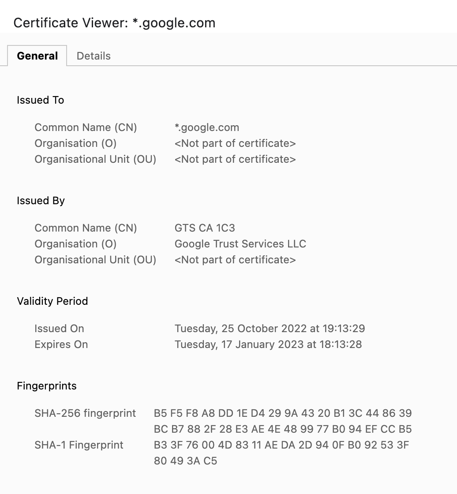
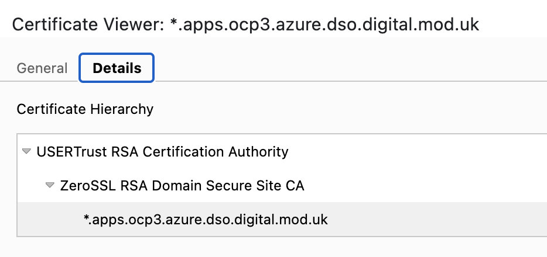
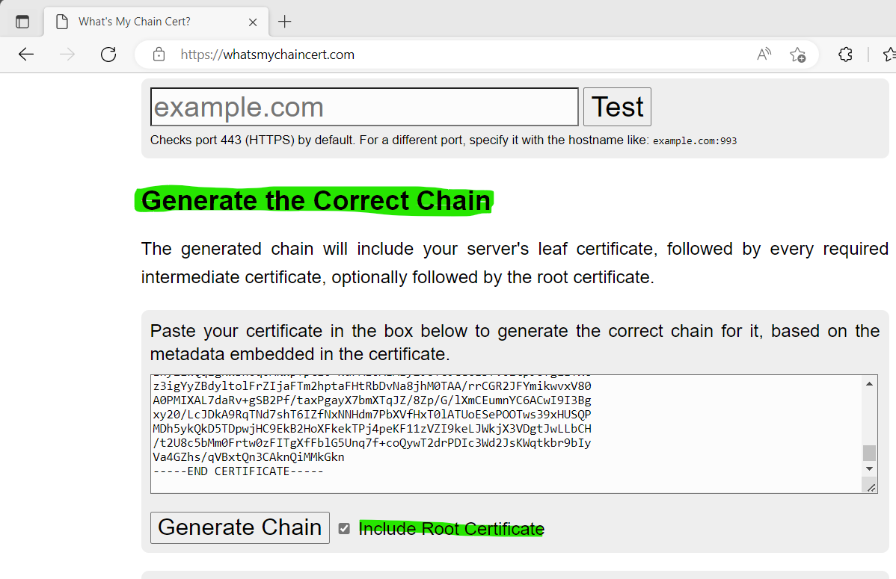

# Digital Certificates in D2S

## Background

OpenShift like most secure services, uses a Digital Certificate as a key enabler to provide secure communications between systems and clients.

These certificates are issued by a Certificate Authority (CA). The CA is an entity that has been entrusted the responsibility to securely issue certificates, and hence is a key component in the process.

To request a certificate an organisation would normally...

* Create a Keypair (public and private key)
* Create a Certificate Signing Request for their Service (eg `mysite.com`), which also embeds your public key.
* Submit to a CA - which verifies the ownership of the domain and service (`mysite.com`)
* If verified, the CA signs the CSR, using *their* trusted CA certificate, creating your service Certificate
* Certificate is returned or made available to the user

All of these steps seem simple, but they create a highly secure certificate chain of trust, where the certificate issued to `mysite.com` will be implicitly trusted by any visitors, provided they already trust the CA that signed the certificate.

To ensure that visitors trust the CA, most modern browsers, Operating Systems and devices, embed a series of trusted CA certificates, so that visitors/clients will not have to import these CA certs themselves.

Certificates can become stale, services change, and keys can be lost or compromised, so to ensure certificates remain secure for their lifetime, it is general best practice to expire and rotate your service certificate regularly. Expiring certificates yearly has been a common pattern, but with tha advent of automation, and focus on cyber security, many organisations and public sites (such as `google.com`) now expire certificates after 3 months.

See the diagram below for an example.



## Certificates in D2S

OpenShift uses certificates to secure communications in many parts of the overall platform, including securing communications between nodes, connections to the kubelet and etcd, and securing communications to the API, Console and any applications that do not provide their own certificates.

During installation, OpenShift provides the option of adding a pre-created Certificate that will subsequently be used by the platform to secure communications between the platform and any clients accessing the API, Console or user applications. 

Obviously, as time passes, this certificate will expire, and will need to be updated with a newly issued certificate.

> :exclamation: The examples below are based on OCP3. Change any URLs, certs, names, etc to suit your env.


## Rotating Ingress Certificates in OpenShift

> :warning: Access to the cluster with `cluster-admin` privileges is required to update the certificates in use by the cluster.

The documentation for updating the default ingress certificate(s) is described in detail in the official documentation. 
https://docs.openshift.com/container-platform/4.11/security/certificates/replacing-default-ingress-certificate.html


### Pre-Reqs

* CLI access to the cluster using the `oc` command line utility
* `cluster-admin` permissions
* Newly signed certificate for the cluster you are updating eg `myocpcluster.xxx.yyy.com` 
* Original private key used when creating the CSR
* The complete certificate chain of trust, including all CA and Subordinate CA certificates within the full chain


### Update the CA

OpenShift ships with the default `ca-certificates` package which includes the most popular CA root certificates, however the new premium ZeroSSL CA used for D2s in Official, is not included, so the default ca-bundle needs to be updated.

The official documentation mentioned earlier, clearly describes this process, and the steps are repeated below.

However the CA files are provided, ensure you have the full chain. For ZeroSSL this includes the upstream to them, root CA (USERTrust RSA Certificate Authority), ZeroSSL themselves (ZeroSSL RSA Domain Secure Site CA) and our certificate (for `*.apps.ocp3.azure.dso.digital.mod.uk`). See the picture below for a visualisation of this hierarchy.



These may come together as a single file, or as multiples. Either way, they must be PEM formatted. If they are already in one file in PEM format, you are good to go. If not, concat the files together like so.

```
$ cat cert1.crt cert2.crt > custom-ca-bundle.crt
```

> :bulb: To check if the certificates are in PEM format, simply `cat` the file(s) to stdout. PEM formatted certs are simply base64 encoded, bounded by BEGIN and END tags. Here is a shortened example.
```
-----BEGIN CERTIFICATE-----
MIIHMTCCBRmgAwIBAgIQMLaf/pH3v6KoafIS+jktODANBgkqhkiG9w0BAQwFADBL
MQswCQYDVQQGEwJBVDEQMA4GA1UEChMHWmVyb1NTTDEqMCgGA1UEAxMhWmVyb1NT
/t2U8c5bMm0Frtw0zFITgXfFblG5Unq7f+coQywT2drPDIc3Wd2JsKWqtkbr9bIy
Va4GZhs/qVBxtQn3CAknQiMMkGkn
-----END CERTIFICATE-----
```

Once you have the bundle, create a ConfigMap in the `openshift-config` namespace so that OpenShift can consume it. 

* The name of the ConfigMap is not important, but make it something sensible to reduce later confusion, as you will be referencing it.
* Pass the path to the bundle you created above, or the name of the bundle you were provided. The initial `--from-file=ca-bundle` is the reference in the ConfigMap, and must be set to this.

*`Create the configmap`*
```
$ oc create configmap custom-ca-bundle --from-file=ca-bundle.crt=custom-ca-bundle.crt -n openshift-config
configmap/custom-ca-bundle created
```

Once created, you need to update the global cluster config so that it will add this CA to the larger trusted CA bundle, and distribute it around the cluster.

*`Patch the Cluster Config`*
```
$ oc patch proxy/cluster --type=merge --patch='{"spec":{"trustedCA":{"name":"custom-ca-bundle"}}}'
```

Check this has been applied correctly, by querying the config.
*`Query the Cluster Config`*
```
$ oc get proxy/cluster -o yaml | grep -B1 -A2 trustedCA
spec:
  trustedCA:
    name: custom-ca
status: {}
```

### Update the Ingress Certificate and Key

Similarly to the Global CA certs updated above, OpenShift stores the ingress certificate and its private key in a Secret within the `openshift-ingress` namespace, so that the ingress controller can consume it.

The official documentation mentioned earlier, clearly describes this process, and again the steps are repeated below.

The certificate and private key may be provides as a single file in a bundle (usually pfx format), or as individual PEM formatted files. If you have the latter, you are good to go. If you have a bundle you must extract the certificate and private key from the bundle.


#### (Optional) Extract from a .pfx Bundle

A `.pfx` bundle requires a password to be set when creating, and used when extracting, even if no password was set, eg it is blank. Simply hit `Enter` when asked, if you have no password set.

*`Extract the Private Key`*
```
$ openssl pkcs12 -in bundle.pfx -nodes -nocerts -out cert.key
```

*`Extract the Wildcard Certificate`*
```
$ openssl pkcs12 -in bundle.pfx -nodes -clcerts -nokeys -out wildcard-cert.crt
```

Once you have the cert and private key, you're nearly there.

Remember that ca-bundle you created earlier? You need it again.

> :exclamation: As there can be more than one ingress controller within an OpenShift cluster, and each may control different domains, and certificates from different CAs, you must also include the CA bundle created earlier within the secret created for the ingress controller to consume.

The certificate entry in the secret, needs the service certificate we received, plus the certificate CA chain of trust. The simplest method here, is to concat them all together again. Remember all certs need to be PEM formatted, so check first.

*`Create a 'SuperCert' file`*
```
$ cat custom-ca-bundle.crt wildcard-cert.crt > cert.crt
```

And then create the secret...
- Again the name of the secret is not important, but make it something sensible to reduce later confusion, as you will be referencing it.
- Again, `--cert=cert.crt` and `--key=cert.key` are required names.

*`Create the secret`*
```
$ oc create secret tls ingress-certs-001 --cert=cert.crt --key=cert.key -n openshift-ingress
secret/ingress-certs-001 created
```

Finally we patch the Ingress Operator, which will re-configure the Ingress Controller.

*`Patch the controller`*
```
$ oc patch ingresscontroller.operator default --type=merge -p '{"spec":{"defaultCertificate": {"name": "ingress-certs-001"}}}' -n openshift-ingress-operator
```

At this point the router pods should be restarted and the new certificates will be applied. You can monitor this by querying the pods in the `openshift-ingress` namespace. Be aware this can take a few minutes per router.

*`Query Router Pods`*
```
$ oc get po -n openshift-ingress
NAME                             READY   STATUS    RESTARTS   AGE
router-default-89cdcdb5d-4xgqh   1/1     Running   1          2s   <<<< This new pod has just replaced an earlier one
router-default-89cdcdb5d-snglg   1/1     Running   1          29d
router-default-89cdcdb5d-w9bsl   1/1     Running   1          29d
```

If the pods do not auto-restart, you may need to delete the pod(s) manually. Do this sequentially, one at a time, to ensure cluster availability.

*`Delete Router Pod`*
```
$ oc delete pod router-default-89cdcdb5d-4xgqh -n openshift-ingress
```

## Rotating K8S API Certificates in OpenShift

### Pre-Reqs

Following the same steps generate the Full Chain Cert and Key files. Optionally for validation purpose create a file containing the CA and Root Certs only.

```
$ ls -l
total 28
-rw-r--r--. 1 kareem kareem 7082 Dec  1 17:58 api-bundle.crt      <--- The Full Bundle
-rw-------. 1 kareem kareem 2715 Dec  1 17:56 api-cert.crt        <--- The Leaf Certificate (Extracted from pfx) 
-rw-r--r--. 1 kareem kareem 3644 Dec  1 17:56 api-cert.pfx        <--- The pfx file
-rw-r--r--. 1 kareem kareem 4525 Dec  1 17:57 ca.crt              <--- CA and Root Certs Only
-rw-------. 1 kareem kareem 1704 Dec  1 17:57 cert.key            <--- Key file (Extracted from pfx)
```

#### Run openssl Validation commands

* 1- Verify the leaf cert using the CA file
```
$ openssl verify -CAfile ca.crt api-cert.crt
api-cert.crt: OK
```

* 2- Verify that the CN matches the hostname it's generated for
```
$ openssl x509 -in api-bundle.crt -noout -text | grep CN
        Issuer: C = AT, O = ZeroSSL, CN = ZeroSSL RSA Domain Secure Site CA
        Subject: CN = api.ocp3.azure.dso.digital.mod.uk
```

* 3- Verify that the key and the cert bundle are matching
```
$ openssl x509 -in api-bundle.crt -modulus -noout | openssl md5
MD5(stdin)= 59d945ab35da653b99c0bc13fc542308


$ openssl rsa -in cert.key -modulus -noout | openssl md5
MD5(stdin)= 59d945ab35da653b99c0bc13fc542308
```

Proceed to the next step Only if validation has passed.

#### Adding the API certificate in OpenShift 

1- Create a secret that contains the certificate chain and private key in the openshift-config namespace.
```
$ oc create secret tls api-certs-002 --cert=api-bundle.crt --key=cert.key -n openshift-config
```

2- Update the API server to reference the created secret.
```
$ oc patch apiserver cluster --type=merge -p '{"spec":{"servingCerts": {"namedCertificates": [{"names": ["api.ocp3.azure.dso.digital.mod.uk"], "servingCertificate": {"name": "api-certs-002"}}]}}}' 
```

3- Check the kube-apiserver operator, and verify that a new revision of the Kubernetes API server rolls out

```
$ oc get clusteroperators kube-apiserver
```
References:
- https://docs.openshift.com/container-platform/4.10/security/certificates/api-server.html#api-server-certificates

### Missing CAs?

If you never received the CAs, but you have another endpoint that you know uses the same CAs, you can extract using a web browser such as Chrome, or a cli tool such as `openssl`.

OpenSSL has a built in secure client that can connect to the service, and dump the certs used by the service in the exchange, which will include any CA certs as well as your service cert.

*`The Plain OpenSSL Way`*
```
$ openssl s_client -showcerts -verify 5 -connect console-openshift-console.apps.ocp3.azure.dso.digital.mod.uk:443
```

This builds on the above, but uses AWK to dump the certs into a series of `.crt` files

*`The OpenSSL and AWK Way`*
```
$ openssl s_client -showcerts -verify 5 -connect console-openshift-console.apps.ocp3.azure.dso.digital.mod.uk:443 < /dev/null |  awk '/BEGIN CERTIFICATE/,/END CERTIFICATE/{ if(/BEGIN CERTIFICATE/){a++}; out="cert"a".crt"; print >out}'

$ tree
.
├── cert1.crt
├── cert2.crt
└── cert3.crt
```

### Alternative way to extract the full CA Chain (Recommended)

Using https://whatsmychaincert.com/

Generate the correct chain by pasting the server/leaf certificate and checking the "Include Root Certificate".

* Extract the certificate from the pfx file

```
$ openssl pkcs12 -in bundle.pfx -nodes -clcerts -nokeys -out wildcard-cert.crt
```

* Generate the correct chain

By pasting the server/leaf certificate and checking the "Include Root Certificate".



The Generated bundle will include the wildcard/api leaf certificate, followed by every required intermediate certificate, finally followed by the root certificate, which exactly how OpenShift will consume it.

